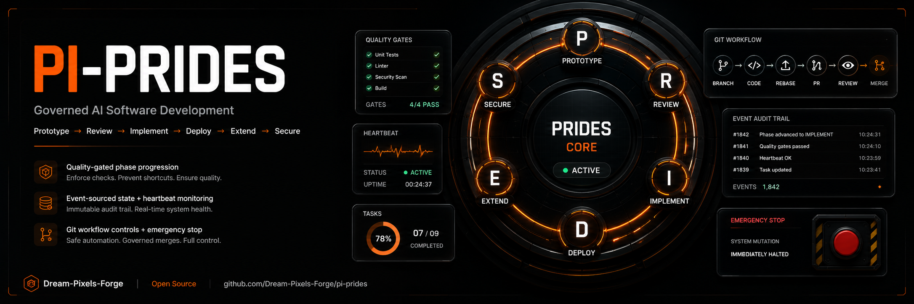

# PRIDES for pi



A **PRIDES** (Prototype → Review → Implement → Deploy → Extend → Secure) governance
extension for the [pi](https://github.com/earendil-works/pi) coding agent.

PRIDES turns "just keep coding" into a **quality-gated, health-monitored software
development lifecycle**. The extension enforces the linear phase flow, runs
quality gates, records heartbeat pulses, supports an emergency stop, and keeps
an event-sourced audit trail of every state change — all persisted into the
session so it survives reloads and branch navigation.

## What it does

- **Phase progression** — enforces `P → R → I → D → E → S` linear flow.
- **Quality gates** — per-phase gates (`test-unit`, `linter`, `security`, …) that
  must pass before a phase can advance. Gates run real shell commands or check
  for artifact files; manual gates require human sign-off (and block advancement until
  signed off via `prides_gate <name> approve=true` or `/prides approve <name>`).
- **Tool & session guards** — blocks `write`/`edit` during Review/Deploy/Secure
  phases and blocks session switches/forking while a critical phase has failing
  gates (all overridable with flags).
- **Heartbeat monitoring** — configurable pulse interval per phase; flags the
  agent as `STALLED` when double the interval elapses.
- **Emergency stop** — halts all mutating tools and signals the human governor;
  cleared with `prides_emergency_resume`.
- **Event-sourced state** — every change is appended to an audit trail and the
  full state is persisted to the session (branching-safe).
- **Scaffolding** — `prides_scaffold` creates `.prides/`, `intent.json`, and
  `dev_notes/` docs.

## Architecture

The heavy logic is **decoupled and unit-tested**. The extension is two layers:

```
extensions/prides/
├── types.ts          Domain types (pure)
├── phases.ts         Phase model + advance/set validation (pure)
├── gates.ts          Gate definitions + evaluation (pure, injected runner/globber)
├── heartbeat.ts      Interval lookup + staleness (pure)
├── scaffold.ts       File-plan generator (pure)
├── state.ts          State construction + event-sourced audit trail (pure)
├── shell.ts          POSIX shell-quoting helpers (pure)
├── gitWorkflow.ts    Branch taxonomy + step transitions (pure)
├── engine.ts         PRIDESEngine orchestration (pure — no pi, no fs, no clock)
└── index.ts          ExtensionAPI wiring (tools, /prides command, guards, resources)
```

`engine.ts` and everything it depends on import **nothing** from pi, the
filesystem, or the wall clock — those are injected — so the whole core is
covered by Vitest without a running pi. `index.ts` is the only host-aware file.

## Install

```bash
# Install from GitHub (recommended)
pi install git:github.com/Dream-Pixels-Forge/pi-prides@v1.6.1

# Or latest (no version pin)
pi install git:github.com/Dream-Pixels-Forge/pi-prides
```

Or try it for a single session without installing:

```bash
pi -e git:github.com/Dream-Pixels-Forge/pi-prides
```

> Requires `@earendil-works/pi-coding-agent` >= 0.74.0. The bundled `skills/`
(real pi `SKILL.md` files) and `prompts/` are contributed to pi's resource
discovery, so the skills become available as capabilities and the prompts
become available as slash commands.

## Tools (for the LLM)

| Tool | Purpose |
|------|---------|
| `prides_status` | Phase, heartbeat, gate, task, emergency state |
| `prides_phase_advance` | Advance to next phase (validates gates; `force`) |
| `prides_phase_set` | Set phase explicitly (`force` to skip gate checks) |
| `prides_gate` | Run a single named gate |
| `prides_gates` | Run all gates for the current phase |
| `prides_heartbeat` | Record a health pulse + intent |
| `prides_emergency_stop` | Halt mutations, signal governor |
| `prides_emergency_resume` | Clear the emergency stop |
| `prides_artifact` | Log a phase artifact to the audit trail |
| `prides_scaffold` | Generate `.prides/`, `intent.json`, `dev_notes/` |
| `prides_report` | Full session report + recommendations (pass `format: "json"` for a structured telemetry snapshot) |
| `prides_task_add` | Track a task in the current phase (triggers goal drift check if a goal is set) |
| `prides_task_done` | Mark a task complete by id |
| `prides_task_list` | List all tracked tasks |
| `prides_goal_set` | Define the project goal + success criteria for drift tracking |
| `prides_goal_check` | Run a goal drift check now (throttled; auto-fires on task-add & heartbeat) |
| `prides_goal_verify` | Verify all success criteria before advancing past Implement or into Secure |
| `prides_drift_ack` | Acknowledge a goal-drift warning so phase advance is permitted again |
| `prides_plan` | Generate a goal-enforced implementation plan and write `dev_notes/PLAN_AUTO.md` |
| `prides_counts_update` | Update `.prides/counts.json` (GitHub-style issue/PR counts from gh CLI) |
| `prides_orchestrate_handoff` | Return a deterministic skill-routing map for the current state |
| `prides_drive` | Recommend the next prides_* tool to call (does NOT auto-execute) |
| `prides_git_status` | Show Git branch taxonomy, workflow step, PR status |
| `prides_git_branch` | Create/track branch (`feature/*`, `hotfix/*`, `bug/*`, `release/*`, `chore/*`) |
| `prides_git_rebase` | Record/execute branch rebase onto target base branch (`main`) |
| `prides_git_pr` | Record/create Pull Request details |
| `prides_git_review` | Record PR code review status (`approved`, `changes_requested`) |
| `prides_git_merge` | Merge feature branch into base branch (`main`) |
| `prides_warn` | Add a warning that may block git operations |
| `prides_warn_resolve` | Resolve (dismiss) an active warning by id |
| `prides_warn_list` | List all active (unresolved) warnings |

## Git Workflow & Branch Taxonomy

`pi-prides` includes an integrated Git Workflow Engine:
- **Branch Lifecycle**: `branch` → `code` → `rebase` → `PR` → `review` → `merge`
- **Branch Categories**:
  - `main` / `master` (protected base branch)
  - `feature/*` or `features/*` (new features & improvements)
  - `hotfix/*` (urgent production hotfixes)
  - `bug/*`, `bugs/*`, or `bugfix/*` (bug fixes)
  - `release/*` (version release branches)
  - `chore/*` or `docs/*` (maintenance, documentation)

## Commands (manual)

```
/prides status                       # current phase, gates, heartbeat, tasks
/prides next [force]                 # advance to next phase
/prides gates                        # run all gates for current phase
/prides gate <name>                  # run one gate (e.g. security)
/prides approve <gate>             # sign off a manual gate
/prides hb <intent>                  # record a heartbeat pulse
/prides stop <reason>                # emergency stop
/prides resume                       # clear emergency stop
/prides report                       # full session report
/prides scaffold <name> [purpose]    # generate project structure
/prides task add <desc>              # add a task
/prides task done <id>               # complete a task
/prides task                         # list tasks
/prides git status                   # show active git branch & workflow step
/prides git branch <name>            # track/create feature branch
/prides git rebase                   # record git rebase onto main
/prides git pr [number|url]          # record PR creation
/prides git review <approved|...>    # record PR review verdict
/prides git merge                    # record merge to main
```

## Flags

| Flag | Default | Effect |
|------|---------|--------|
| `--prides-guard` | `true` | Enable write guards in Review/Deploy/Secure |
| `--prides-lax` | `false` | Disable all write guards |
| `--prides-force` | `false` | Allow session switch/fork past guards |

## Phase config

| Phase | Name | Heartbeat | Criticality |
|-------|------|-----------|-------------|
| P | Prototype | 30s | High |
| R | Review | 2m | High |
| I | Implement | 30s | Critical |
| D | Deploy | 1m | Critical |
| E | Extend | 5m | Medium |
| S | Secure | 30s | Critical |

## Customizing gates

`prides_scaffold` writes `.prides/gates.config.json`. Add a `"gates"` array of
`GateDef` objects to override the built-in `DEFAULT_GATES` for your project.
Supported `type` values:

| Type | Required fields | Behavior |
|------|----------------|----------|
| `command` | `command` | Runs a shell command; exit code 0 = pass |
| `artifact` | `artifactGlob` | Passes if the glob matches any files |
| `manual` | — | Requires human sign-off via `prides_gate <name> approve=true` |
| `eval` | `prompt` | LLM-as-judge; configured via the `PRIDES_EVAL_CMD` env var (see [Eval gates](#eval-gates-llm-as-judge)) |

Example:

```json
{
  "gates": [
    { "name": "spec-adherence", "phase": "I", "type": "eval",
      "prompt": "Does every exported function have a JSDoc block describing its purpose?" }
  ]
}
```

## Eval gates (LLM-as-judge)

`eval` gates delegate the pass/fail decision to an LLM. Configure the judge by
setting the `PRIDES_EVAL_CMD` env var to a shell command that receives the
rubric prompt as a single quoted argument and exits `0` (pass) / `1` (fail) /
`2` (warn). The judge is untrusted input — the rubric comes from your repo's
`gates.config.json` and is shell-quoted via POSIX single-quotes before exec.

Example wrapper (Python):

```bash
export PRIDES_EVAL_CMD='python -m my_project.prides_judge'
```

When `PRIDES_EVAL_CMD` is unset, `eval` gates degrade to `warn` (non-blocking).

## Development (TDD — Non-Negotiable)

This project is strictly test-driven. The pure core must stay green:

```bash
npm install
npm test          # vitest — covers phases, gates, heartbeat, scaffold, state, engine
npm run typecheck # tsc --noEmit
npm run lint      # biome
npm run check     # typecheck + lint + test (runs on prepublish)
```

Tests inject a mock clock, command runner, and globber so no shell or
filesystem is touched.

## Goal loop & drift detection (v1.7.0+)

PRIDES treats `intent` (set once at scaffold) as **the spec the agent must
prove it satisfied**. After scaffolding, call `prides_goal_set` with a
one-sentence objective plus checkable success criteria — PRIDES will then:

- **Drift-check on scope decisions**: each `prides_task_add` piggybacks a
  judge call to confirm the new task still aligns with the original goal
  (throttled to once per 5 min, so cost is bounded regardless of task churn).
- **Drift-check on heartbeat**: `prides_heartbeat` does the same piggyback,
  so a long stretch of silent work still gets checked.
- **Auto-warn / auto-stop**: a drift score ≥ 0.5 emits a warning; ≥ 0.85
  triggers the same `emergency_stop` path used for critical gate failures.
- **Verify before critical advances**: `canAdvance()` blocks `I → D` and
  `→ S` until a recent `prides_goal_verify` call reports `aligned: true`.

Drift is a semantic event, not a time-based one, so the trigger is *task
addition* (when scope decisions happen), with heartbeat as a throttled
fallback. See `dev_notes/goal-loop-implementation-plan.md` for the full
design rationale.

## Bundled methodology content

The repository ships pi-native prompt and skill content as discoverable
resources:

- `prompts/` — workflow prompts (`/init`, `/review`, `/start-sprint`, …)
- `reference/claude-code/` — historical Claude Code coordinator +
  phase-subagent drafts. **Reference only**; pi has no agent API, so these
  are not executed by the extension. They are kept in `reference/` (not
  `agents/`) so they don't ship as if pi executed them — see ADR
  `dev_notes/decisions/0001-delete-orphan-agents.md`.
- `skills/` — PRIDES-native pi skills:

| Skill | Triggers On | Purpose |
|-------|-------------|---------|
| `prides-init` | "start project", "initialise PRIDES" | Bootstrap PRIDES phase, scaffold, set intent |
| `prides-implementation` | "build", "implement", "code", "develop", "TDD" | Vertical slice architecture + strict TDD enforcement |
| `prides-review` | "review", "code review", "PR check" | Run Review gates, require human sign-off |
| `prides-gate-loop` | "run gates", "check gates" | Iterate on failing gates until all pass |
| `prides-deploy` | "deploy", "release", "ship" | Deploy phase gates and pre-flight checks |
| `prides-secure` | "audit", "security", "harden" | Secure-phase audit + emergency stop |
| `prides-heartbeat` | "heartbeat", "status check" | Record health pulse and intent |
| `prides-guard` | "is this safe", "will PRIDES block this", "before I write/commit" | Pre-action guardrail screen — verdict allow/warn/block against current PRIDES state |
| `prides-orchestrate` | "PRIDES", "next phase", "what now" | Classify the task and route to the right specialist skill (review/deploy/secure/heartbeat/gate-loop) |
| `prides-cybersec` | "vulnerability", "CVE", "prompt injection", "supply chain", "PQC", "incident", "breach", "zero trust", "LLM security", "AI attack" | **Full 2026+ cybersecurity skill** — threat taxonomy, scanner config, remediation playbooks, incident response, post-quantum readiness |

### `prides-cybersec` Skill Structure

```
skills/prides-cybersec/
├── SKILL.md                          # Skill instructions + workflow
└── references/
    ├── threat-taxonomy.md            # Full 2026+ threat taxonomy (MITRE, OWASP)
    ├── remediation-playbooks.md      # Code-level fix recipes per threat type
    └── secure-defaults.md            # Security-by-default config checklists
```

**Covered threat domains:**
- Supply-chain attacks (T1.1 dependency confusion, T1.2 CI poisoning, T1.3 SBOM gaps)
- Secrets & IAM (T2.1 leakage, T2.2 JWT abuse, T2.3 over-privilege, T2.4 MFA bypass)
- Injection (T3.1 SQL, T3.2 SSRF, T3.3 XSS, T3.4 prompt injection, T3.5 SSTI)
- Cryptography (T4.1 weak algorithms, T4.2 TLS misconfig, T4.3 PQC readiness, T4.4 secrets at rest)
- Container / cloud-native (T5.1–T5.5: privilege escalation, image CVEs, RBAC, IMDS, storage ACLs)
- LLM & AI-specific (T6.1–T6.5: prompt injection, training data extraction, agent privilege escalation, AI-generated social engineering)
- Memory safety (T7: buffer overflows, use-after-free in FFI)
- Data privacy & compliance (T8: PII leakage, GDPR/AI Act)

## License

MIT © Dream-Pixels-Forge
